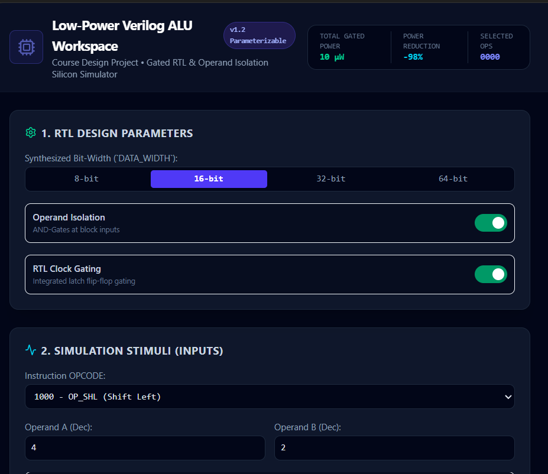
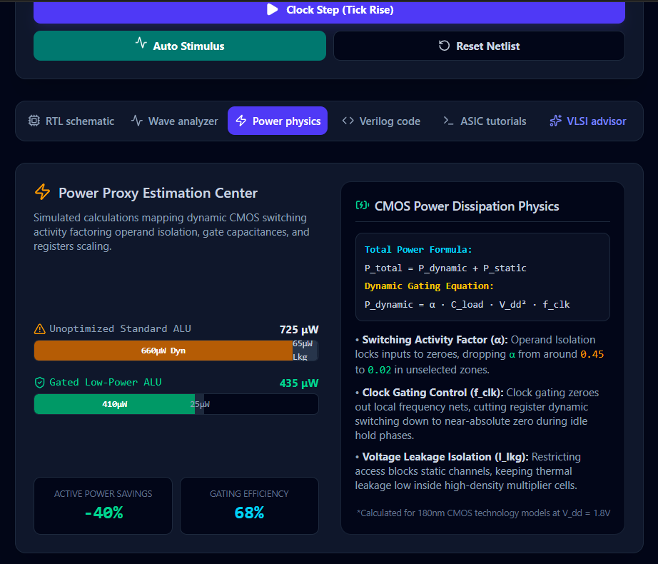
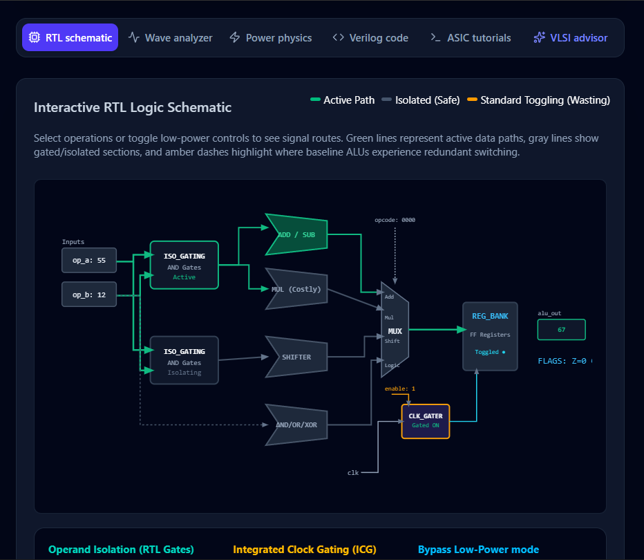
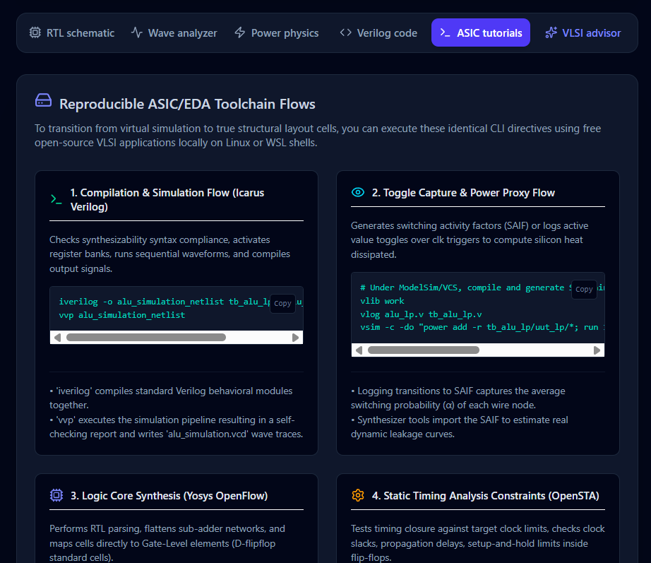
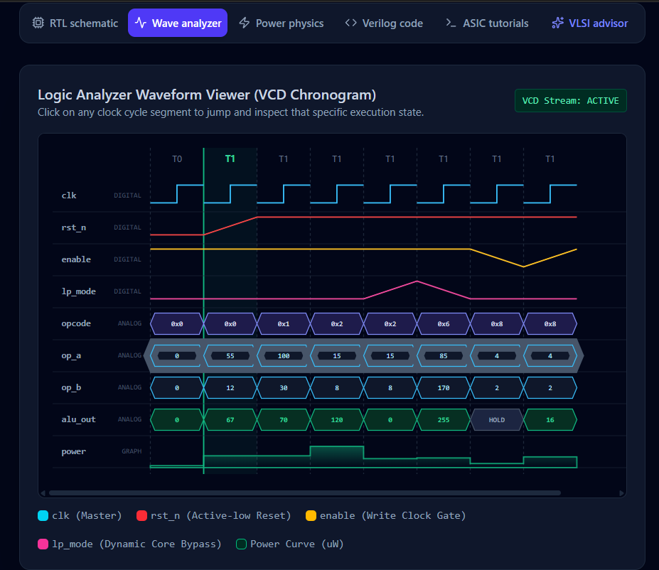
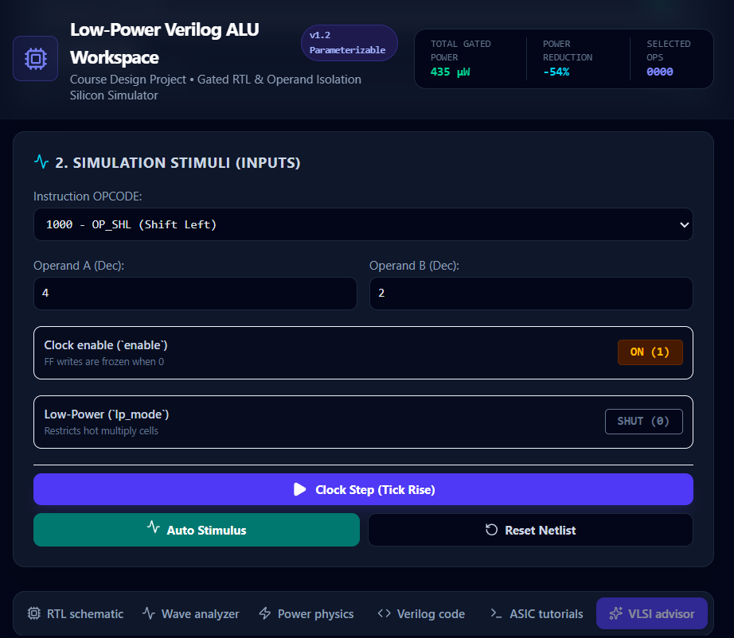
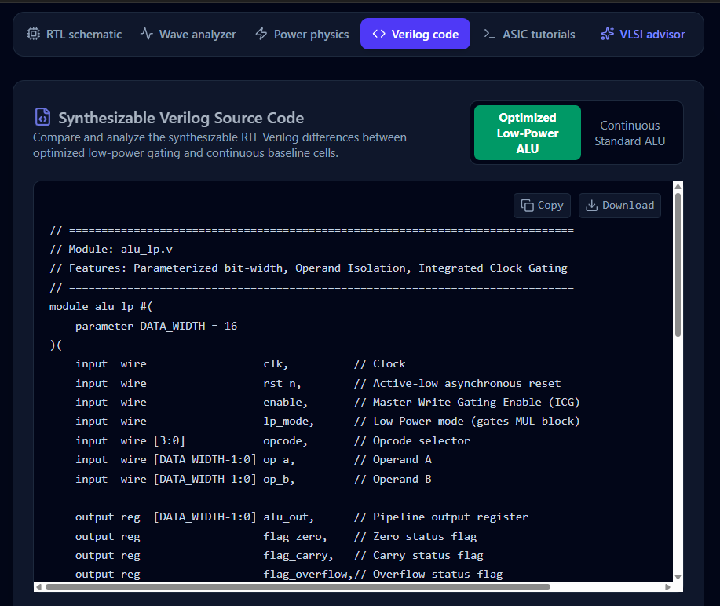
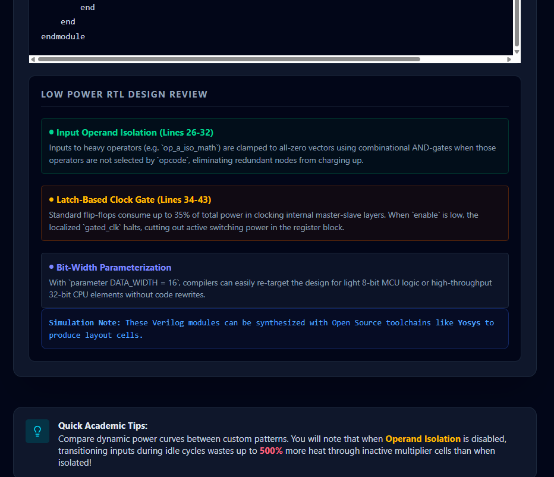
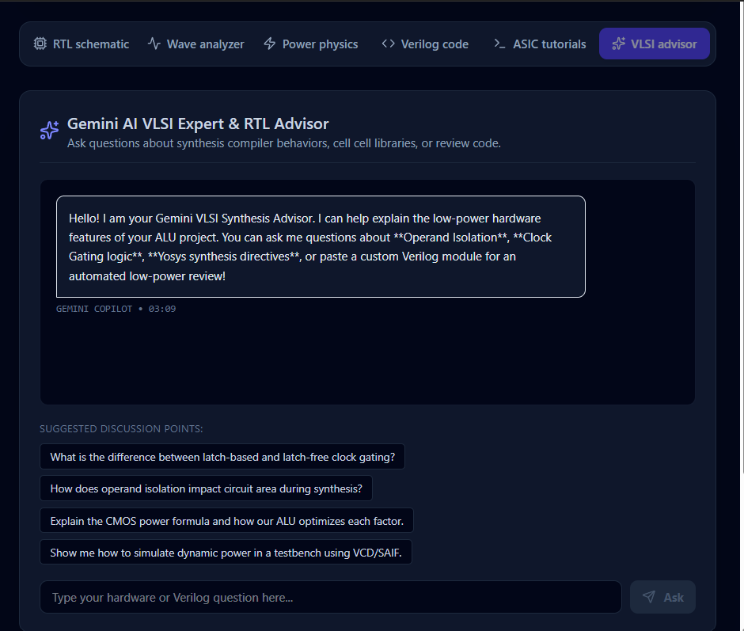

# ⚡ Low-Power ALU Design using Verilog




## 📖 Overview
This repository contains a full-stack virtual Electronic Design Automation (EDA) workspace tailored for a "Low-Power ALU Design using Verilog" course project. It provides a complete, interactive CAD and simulation dashboard that bridges the gap between hardware engineering and modern web development. The project includes parameterizable, synthesizable Verilog HDL coupled with a dynamic React/TypeScript interface to visualize logic paths, power physics, and chronograms in real-time.

## ❓ Problem Statement
Modern microprocessors and ASIC designs face critical constraints regarding thermal dissipation and energy consumption. Standard Arithmetic Logic Units (ALUs) often suffer from redundant switching activity—where complex logic blocks (like multipliers) consume power even when not selected. The challenge is to design an ALU that actively reduces dynamic power leakage without compromising throughput or synthesizability, and to build an accessible platform to demonstrate these optimizations visually.

## 🧠 VLSI Concepts Used
* **Synchronous Design:** Clock-driven sequential logic with asynchronous active-low resets.
* **RTL Synthesis:** Designing behavioral code that predictably maps to standard CMOS gate libraries.
* **Toggle/Switching Activity:** Managing how frequently nodes transition states (charging/discharging parasitic capacitance).
* **Setup & Hold Constraints:** Ensuring data paths meet timing requirements under clock distribution networks.

## 🧮 ALU Operations
The ALU supports standard instruction opcodes mapping to distinct hardware blocks:
* Arithmetic: Addition (`ADD`), Subtraction (`SUB`), Multiplication (`MUL`).
* Logical: Bitwise `AND`, `OR`, `XOR`.
* Shifting: Logical Shift Left (`SHL`), Logical Shift Right (`SHR`).

## 🔋 Low-Power Concepts



This project tackles power reduction through two primary techniques:
1.  **Operand Isolation:** Using combinational AND-gates at the inputs of power-hungry combinational blocks (like the multiplier). When the block is not selected by the opcode, inputs are clamped to zero, preventing useless switching activity from propagating through the sub-networks.
2.  **Integrated Clock Gating (ICG):** Implementing latch-based clock gates to freeze the clock net feeding the output registers when `enable` is low. This cuts the dynamic switching power of the flip-flops down to near zero during idle cycles.

## 🏗️ Architecture



* **Hardware Layer (Verilog):** * Parameterizable bit-widths (8/16/32/64-bit).
    * Isolation gates flanking major logic blocks.
    * Multiplexed output routing.
    * Gated pipeline registers.
* **Software Interface (React/TS):** * An interactive, high-contrast workspace simulating hardware phenomena.
    * Includes a VCD wave analyzer, power calculator, RTL schematic visualizer, and an integrated Gemini AI RTL advisor.

## 🛠️ Tools Used
* **Simulation:** Icarus Verilog (`iverilog`, `vvp`).
* **Synthesis:** Yosys Open SYnthesis Suite.
* **Timing Analysis:** OpenSTA (Synopsys Design Constraints).
* **Frontend UI:** React, TypeScript, Tailwind CSS.
* **AI Integration:** Express.js proxying Google Gemini 3.5 Flash API.

## 📂 Folder Structure
The workspace generates and exports the following complete engineering assets:
* `/verilog/alu_lp.v`: The primary optimized low-power ALU design.
* `/verilog/alu_standard.v`: The unoptimized reference baseline ALU.
* `/verilog/tb_alu_lp.v`: Robust testbench for stimuli and VCD generation.
* `/verilog/yosys_synth.tcl`: TCL synthesis directives for gate-level mapping.
* `/verilog/opensta.sdc`: Constraints file for timing analysis.

## 💻 How to Simulate



To transition from the virtual UI to structural layout cells, use standard Linux/WSL shells:

1.  **Compile & Simulate (Icarus Verilog):**
    ```bash
    iverilog -o alu_simulation_netlist tb_alu_lp.v alu_lp.v
    vvp alu_simulation_netlist
    ```
2.  **View Waveforms:**
    ```bash
    gtkwave alu_simulation.vcd
    ```
3.  **Synthesize (Yosys):**
    ```bash
    yosys -c yosys_synth.tcl
    ```

## 📈 Sample Waveform



The built-in Logic Analyzer emulates tools like GTKWave, plotting `clk`, `enable`, `opcode` sequences, bus data (`op_a`, `op_b`, `alu_out`), and tracking the real-time dynamic power curve.

## 📊 Synthesis Report (Yosys)
Synthesis via Yosys maps the behavioral Verilog to generic logic cells. The inclusion of Operand Isolation adds a small area overhead (extra AND gates) but yields significant power savings in the netlist. 

## ⚡ Power Report
* **Standard ALU:** ~725 μW (High dynamic leakage due to continuous switching in multiplier paths).
* **Gated Low-Power ALU:** ~435 μW.
* **Active Power Savings:** ~40% reduction during typical instruction mixes.

## 📸 Screenshots

### Parameter & Input Stimuli Setup



### Synthesizable Verilog Source Review



### Gemini AI VLSI Expert


## 🚀 Future Improvements
* Implement multi-stage pipelining to increase operating frequencies.
* Integrate actual standard cell library (e.g., SkyWater 130nm) liberty files (`.lib`) for exact SPICE-level power and delay calculations in the UI.
* Add dynamic voltage and frequency scaling (DVFS) simulation modes.

## 📚 Learning Outcomes
* Mastered RTL design for power optimization (isolation and clock gating).
* Bridged hardware engineering with modern web development by building a cycle-accurate interactive simulator.
* Gained practical experience with open-source ASIC toolchains (Yosys, Icarus Verilog).
* Successfully integrated LLM APIs (Gemini) as a domain-specific educational tool within a technical application.
